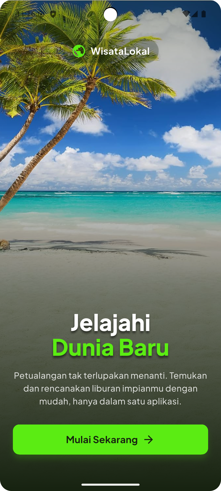
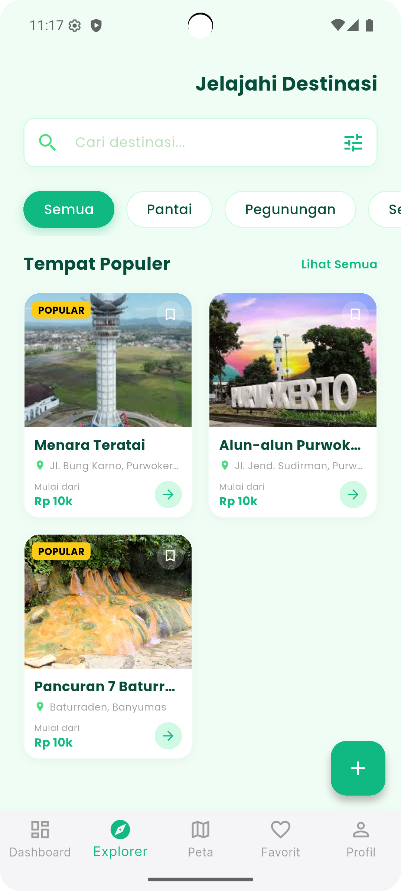
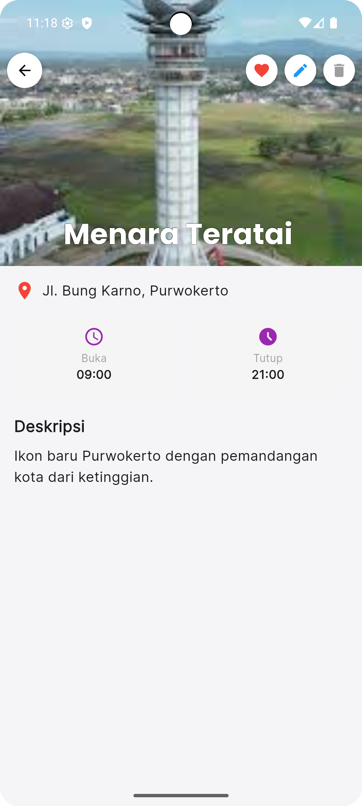
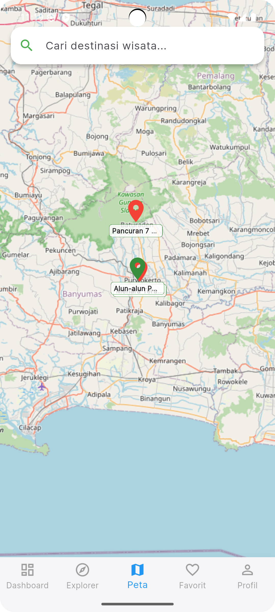
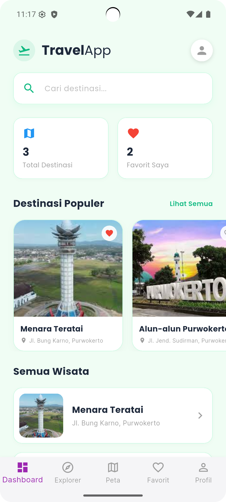
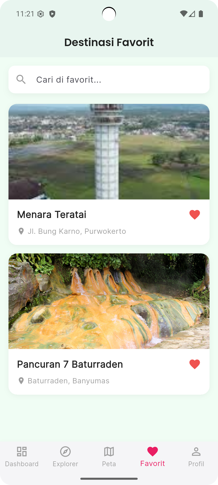
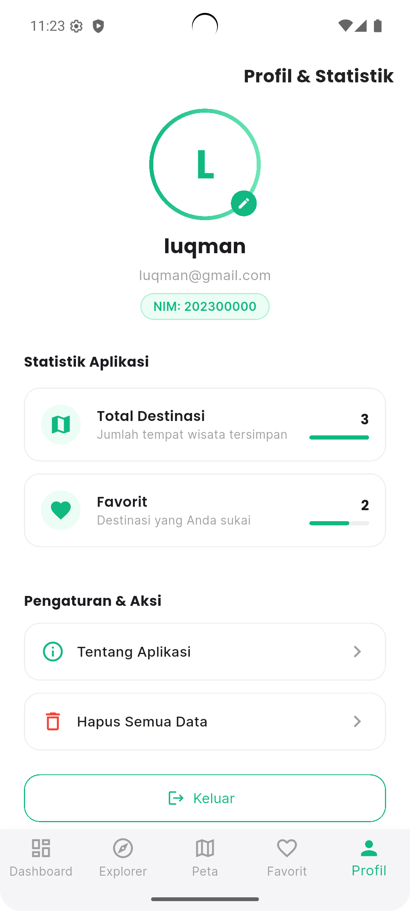

# 🌏 WisataLokal - Aplikasi Travel & Wisata Purwokerto


<p align="center">
  
</p>

<p align="center">
  <b>Jelajahi Keindahan Purwokerto & Sekitarnya</b><br>
  Aplikasi mobile berbasis Flutter yang memudahkan pengguna menemukan, menyimpan, dan mengelola destinasi wisata lokal. Dilengkapi dengan peta interaktif dan manajemen data offline.
</p>

---

## 📱 Tampilan Aplikasi (Preview)

> _Screenshot aplikasi berjalan._

|                           Landing Page                           |                        Explorer (Pencarian)                        |                         Detail Wisata                          |                     Peta Interaktif                      |
| :--------------------------------------------------------------: | :----------------------------------------------------------------: | :------------------------------------------------------------: | :------------------------------------------------------: |
|  |  |  |  |
 
|                              Dashboard                               |                       Edit Destinasi                       |                               Favorit                            |                         Profil Pengguna                          |
| :------------------------------------------------------------------: | :--------------------------------------------------------: | :--------------------------------------------------------------: |:--------------------------------------------------------: |
|  |  |  |  |

---

## 💾 Database & Penyimpanan (Local Only)

Aplikasi ini menggunakan **SQLite (Sqflite)** sebagai penyimpanan utama, menjadikan aplikasi **100% Offline-First**. Tidak memerlukan koneksi internet untuk melihat atau mengelola data destinasi yang tersimpan.

Backend Data:

- **Destinasi:** Nama, Deskripsi, Lokasi (Lat/Long), Jam Buka, Foto.
- **User:** Profil pengguna sederhana (Foto, Nama, Email).
- **Favorit:** Status like/unlike disimpan lokal.

---

## 🚀 Fitur Utama

Aplikasi dirancang untuk kemudahan penggunaan wisatawan:

### 🗺️ Eksplorasi & Peta

- **Pencarian Cerdas:** Cari wisata berdasarkan nama atau lokasi.
- **Peta Interaktif:** Integrasi **OpenStreetMap** (via `flutter_map`) untuk melihat sebaran lokasi wisata.
- **Kategori:** Filter wisata (Pantai, Pegunungan, Sejarah, Kuliner).

### 🛠️ Manajemen Destinasi (CRUD)

- **Tambah Wisata:** Input data wisata baru beserta foto (Galeri) dan lokasi (Map Picker).
- **Edit & Hapus:** Update informasi wisata jika ada perubahan.
- **Map Picker:** Pilih titik lokasi akurat langsung dari peta saat menambah data.

### 👤 Personalisasi

- **Favorit:** Simpan wisata yang ingin dikunjungi ke daftar favorit.
- **Profil:** Manajemen profil pengguna sederhana.

---

# 📘 Struktur & Penjelasan File Dart — WisataLokal

---

# 📂 Struktur Folder & Fungsi File (lib/)

## 🏁 Root & Config (`lib/`)

### **main.dart**

Entry point aplikasi. Mengatur inisialisasi binding, database, dan routing awal ke `LandingPage`.

---

## 🗄️ Database & Models

- **`database/database_helper.dart`** — Singleton class untuk manajemen SQLite. Menangani migrasi DB, CRUD Destinasi, dan User.
- **`models/destination.dart`** — Data model untuk objek wisata.
- **`models/user.dart`** — Data model untuk profil pengguna.

---

## 📱 Screens — Auth & Main (`lib/screens/`)

- **`main_screen.dart`** — Wrapper utama yang menangani **BottomNavigationBar** dan navigasi antar tab (Home, Explorer, Map, Favorite, Profile).
- **`auth/landing_page.dart`** — Halaman sambutan (Onboarding) dengan animasi dan tombol "Mulai Sekarang".

---

## 🗺️ Screens — Core Features (`lib/screens/`)

- **`destination_detail_page.dart`** — Halaman detail wisata. Menampilkan foto, deskripsi, peta statis, dan tombol aksi (Favorit, Edit, Hapus).
- **`add_edit_destination_page.dart`** — Form serbaguna untuk **Menambah** atau **Mengedit** destinasi. Dilengkapi validasi form dan Image Picker.
- **`map_page.dart`** — Tab peta utama. Menampilkan semua marker wisata di atas OpenStreetMap.
- **`map_picker_page.dart`** — Halaman khusus untuk memilih koordinat (Latitude/Longitude) dengan menggeser pin di peta.
- **`profile_page.dart`** — Halaman profil pengguna.

---

## 📑 Screens — Tabs (`lib/screens/tabs/`)

- **`dashboard_page.dart`** — Halaman Beranda (Home). Menampilkan header, kategori, dan rekomendasi wisata populer.
- **`explorer_page.dart`** — Halaman pencarian lanjutan dengan filter kategori dan tampilan Grid.
- **`favorites_page.dart`** — Daftar wisata yang ditandai sebagai favorit oleh pengguna.

---

## 🛠️ Teknologi yang Digunakan

- **Framework:** [Flutter](https://flutter.dev/) (Dart 3.x)
- **Database:** [sqflite](https://pub.dev/packages/sqflite) (SQLite)
- **Maps:** [flutter_map](https://pub.dev/packages/flutter_map) (OpenStreetMap) & [latlong2](https://pub.dev/packages/latlong2)
- **UI/UX:** [google_fonts](https://pub.dev/packages/google_fonts), [introduction_screen](https://pub.dev/packages/introduction_screen)
- **Utilities:** `image_picker`, `path_provider`, `intl`

---

## 👥 Tim Pengembang (Kelompok 1 Orang)

| Nama             | NIM              | Peran                      |
| :--------------- | :--------------- | :------------------------- |
| **Lukman Fauzi** | **STI202102540** | Fullstack Mobile Developer |

---

## ✅ Pemenuhan Kriteria Penilaian

Aplikasi ini dibangun untuk memenuhi 7 aspek penilaian utama:

1.  **UI/Widget & Layout (25%)**

    - Menggunakan `ListView`, `GridView`, `CustomScrollView` (Sliver).
    - Input menggunakan `TextField`, `DatePicker`, `TimePicker` (Dialog).
    - Feedback user menggunakan `QuickAlert` (Toast/Snackbar alternative).
    - Desain responsif dan konsisten dengan tema "Emerald & Purple".

2.  **CRUD SQLite (30%)**

    - **Create**: Form tambah destinasi (Foto & Lokasi).
    - **Read**: List Explorer & Dashboard (Search/Filter).
    - **Update**: Edit data destinasi yang sudah ada.
    - **Delete**: Hapus destinasi dengan konfirmasi keamanan.
    - **Validasi**: Form tidak bisa disimpan jika kosong.

3.  **Navigasi & Menu (15%)**

    - **BottomNavigationBar**: Navigasi utama 5 tab.
    - **Navigation Rail/Menu**: Alur jelas (Landing -> Main -> Detail -> Edit).
    - **Icons**: Penggunaan Material Icons yang relevan.

4.  **Layanan Lokasi / Maps (10%)**

    - **Flutter Map**: Menampilkan marker lokasi wisata.
    - **Map Picker**: Fitur memilih lokasi (Latitude/Longitude) dengan menggeser peta.
    - **Default Location**: Purwokerto (Pusat Kota).

5.  **Distribusi APK & Konfigurasi (10%)**

    - **App Icon**: Custom icon (WisataLokal) terpasang.
    - **App Name**: "WisataLokal" (bukan default flutter_app).
    - **Versioning**: `pubspec.yaml` terkelola dengan baik.

6.  **Dokumentasi & Presentasi (5%)**

    - README.md lengkap dengan struktur file dan cara instalasi.
    - [Script Presentasi](PRESENTATION_SCRIPT.md) tersedia.

7.  **Kerja Kelompok (5%)**
    - Dikerjakan secara mandiri (Individual Project) oleh Lukman Fauzi.

---

## 💻 Cara Menjalankan (Installation)

1.  **Clone Repository**

    ```bash
    git clone https://github.com/username/travel_wisata_lokal.git
    cd travel_wisata_lokal
    ```

2.  **Install Dependencies**

    ```bash
    flutter pub get
    ```

3.  **Setup Assets**
    Pastikan folder `assets/images/` dan `assets/images/upload/` tersedia.

4.  **Run Aplikasi**
    ```bash
    flutter run
    ```
